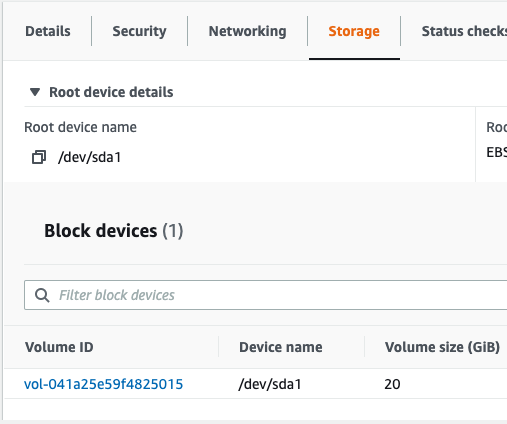
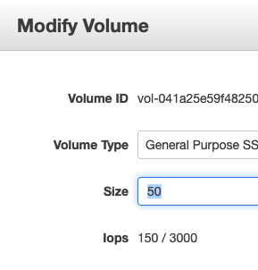

# Resize the filesystem of a forge ubuntu machine

Prerequisites: 

- Ubuntu machine 20GB

Goal:

- To increase the SSD up to 50GB

Steps: 

- Go into your aws account, select the EC2 instance, and check the `Storage` tab down bellow: 

- Click to the `Volume ID` column, and go into the EBS volume

- Choose `Actions -> Modify Volume` action: 

- Input 50 GB and save it.

 Based on [this](https://docs.amazonaws.cn/en_us/AWSEC2/latest/UserGuide/recognize-expanded-volume-linux.html) resource, we will do the next:

- After you ssh into the machine: `lsblk`

- `sudo growpart /dev/nvme0n1 1`

- `sudo resize2fs /dev/root`

- `df -h` - to check the new size

