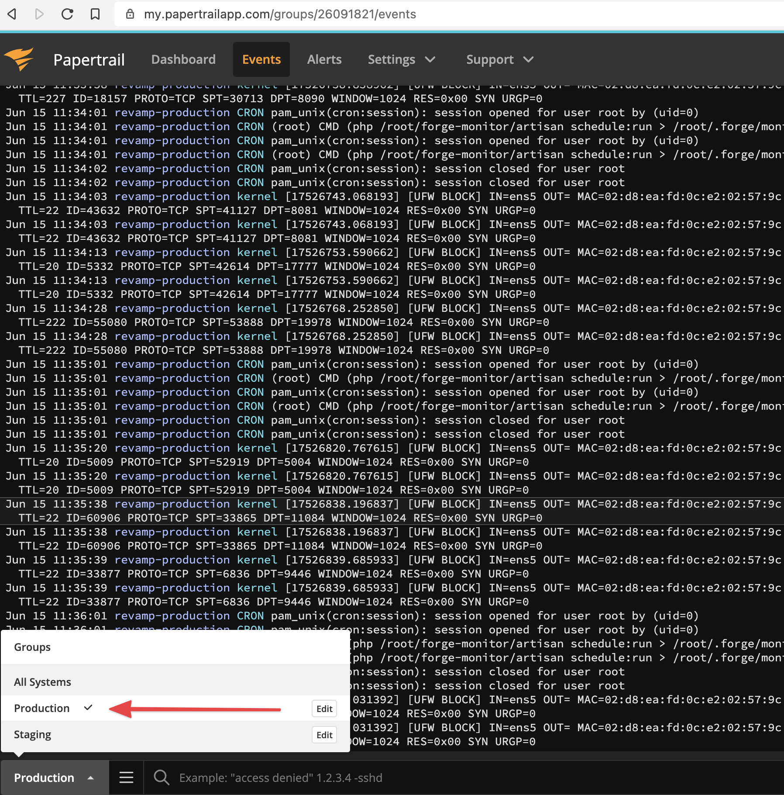
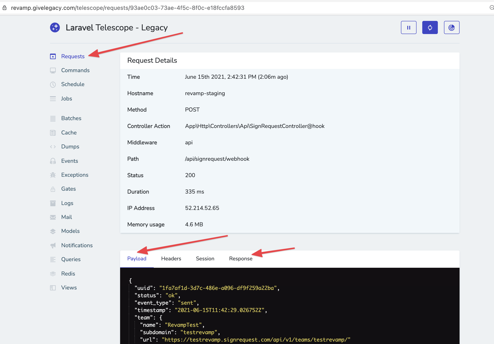
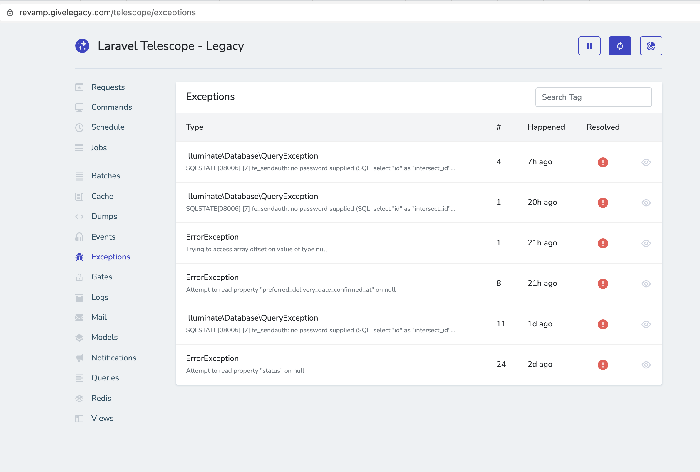
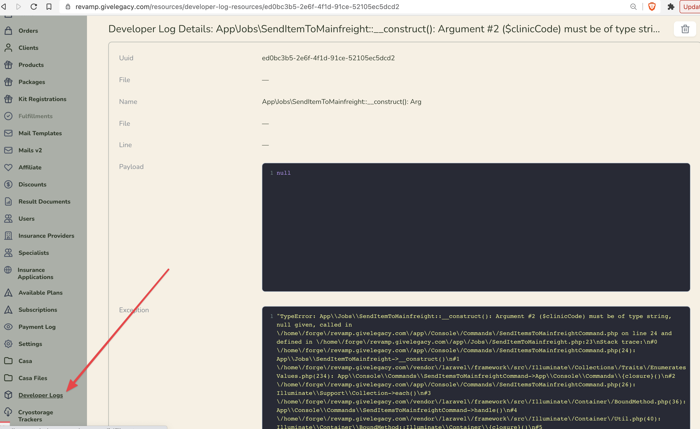
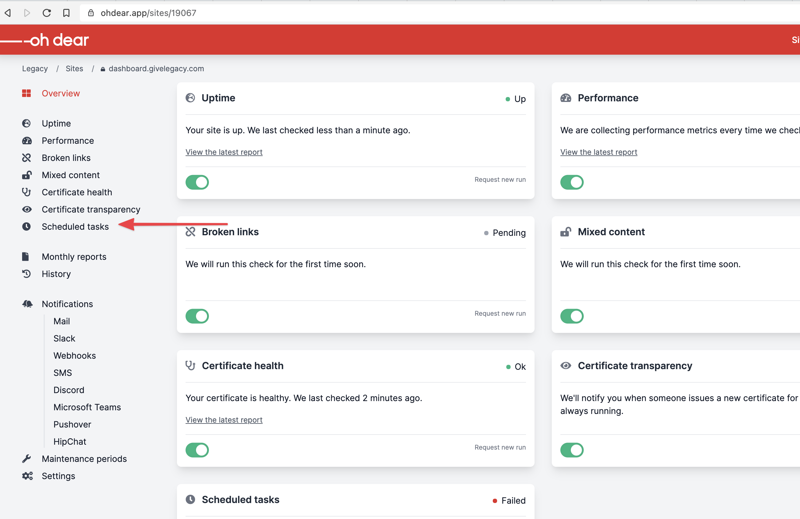
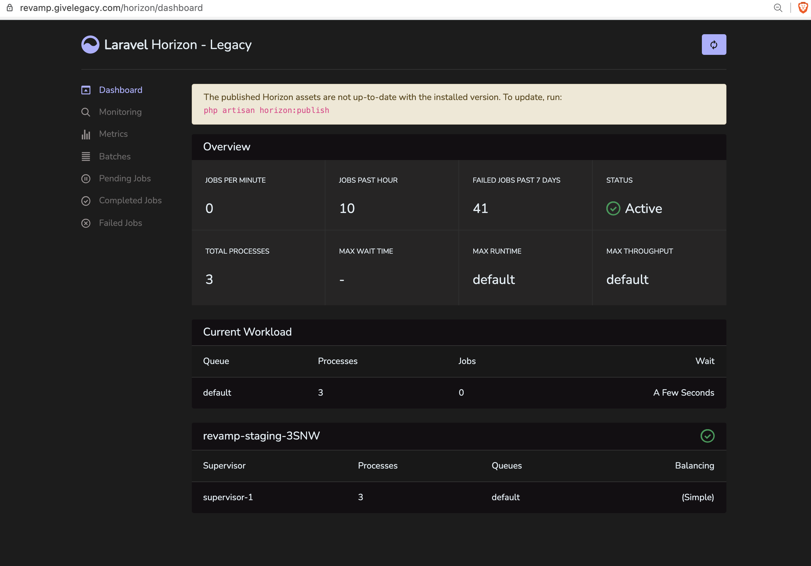

# Monitoring

## Papertrail

[Papertrail](https://my.papertrailapp.com/groups/26091821/events) shows all the laravel and system logs from the `staging` and `production` servers. Credentials shared via 1Password.

To log laravel logs via papertrail the log driver from the `.env` should be `syslog`. This way all logs will be proxied to this service. 



The bottom left dropdown allow you to select the environment you want to list logs. 

You also have a way to search logs using the `search` box from the bottom line.

## Telescope

[Telescope](https://laravel.com/docs/telescope) is a tool to see everything about your internals. It usually lives under `/telescope` url of your app. To allow specific users to access it check the `app/Providers/TelescopeServiceProvider.php:71` gate.

For example, you might want to see a stack trace of a request:



You can see all exceptions: 



## Laravel Developer

[Laravel Developer](https://github.com/BinarCode/laravel-developer) is a tool which allows you to store handled exceptions and send them to a slack channel or to the database and they will be displayed into a nova resource: 



It mainly consists into 4 helpers: 

`slack($e)` or `slack('message')` - this way you can quickly send any exception or message to the configured into `developer.slack_dev_hook` slack channel

`slack($e)->persist()` - this way you sent to slack and store into the nova table.

::: tip
This exceptions could be automatically stored to telescope `exceptions` menu if you have `developer.telescope` on `true`
:::

`devLog('We send this payload, [...])` - this way you can store directly into the nova tabel some logs, with payload. Might be useful to store when you send data to a third party service (as MF).

`telescopeException($e)` - this way you simply store a handled exception to telescope exceptions

For more information check the [documention](https://github.com/BinarCode/laravel-developer).

## Oh dear

[Oh Dear](https://ohdear.app/sites) is a service which displays the status and scheduled commands: 



To add a new site via oh dear, you simply create a new site and add the id into `config/schedule-monitor.oh_dear.site_id` variable, or `OH_DEAR_SITE_ID` in the `.env`

## Horizon

[Horizon](https://laravel.com/docs/horizon) is a tool which run and store all queueable jobs from your application. It usually lives under `/horizon` url. You can retry a failed job, or monitor existing once: 



## Ensure Database Loaded
[Ensure Database Loaded](https://laravel.com/docs/ensure-database-loaded) is used to sync database with what we need. The main command can be found in `app/Console/Commands/EnsureDatabaseStateLoadedCommand.php`
In the handle method we put our classes with `__invoke` function.

This command will be run on each fresh of database (check composer.json)
```"fresh": "php artisan migrate:fresh --seed && php artisan ensure-database-state-is-loaded",```

```
public function handle(): int
{
    collect([

        // This is indeed not imported with use to explain the source. Similar with `app.php -> providers`
        new \Database\State\EnsureCoQ10ProductPresent,
        new \Database\State\EnsureCustomerDeliveryMethodMailPresent,
        new \Database\State\EnsureRolesPresent,

    ])->each->__invoke();

    return 0;
}
```

For example: `EnsureCoQ10ProductPresent.php` checks if database contains product with uuid `COQ10_UUID`.
Don't forget to add `present` method to avoid duplicated items in database.

```
class EnsureCoQ10ProductPresent
{
    public function __invoke()
    {
        if ($this->present()) {
            return;
        }

        Product::query()->create([
            "uuid" => Product::COQ10_UUID,
            "title" => "CoQ10 supplements",
        ]);
    }

    public function present(): bool
    {
        return Product::query()->whereUuid(Product::COQ10_UUID)->exists();
    }
}
```


